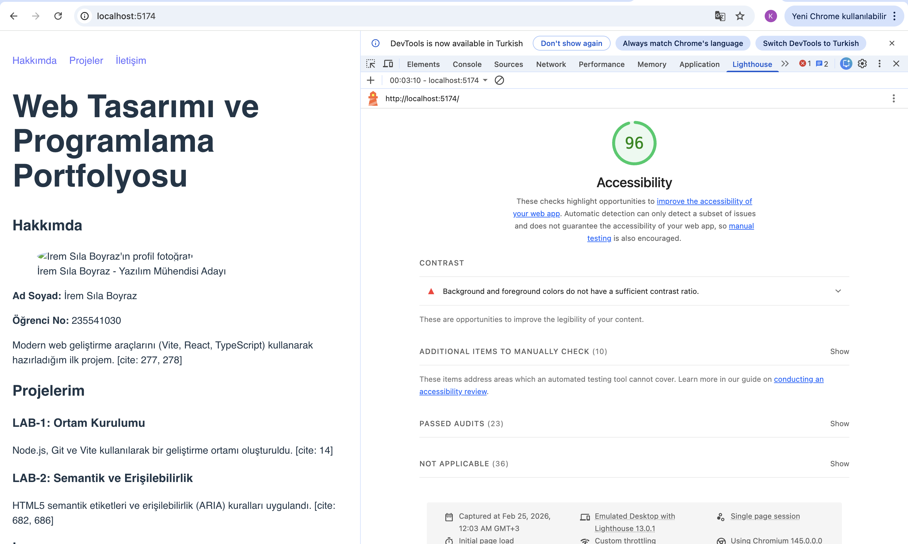

# Web Tasarımı ve Programlama LAB-2
**Ad Soyad:** İrem Sıla Boyraz
**Öğrenci No:** 235541030

## Proje Hakkında
Bu proje semantik HTML5 ve erişilebilirlik (a11y) kurallarına uygun olarak geliştirilmiştir.

## Erişilebilirlik Raporu (Lighthouse)

## Kurulum
1. cd web-lab-hello
2. npm install
3. npm run dev
